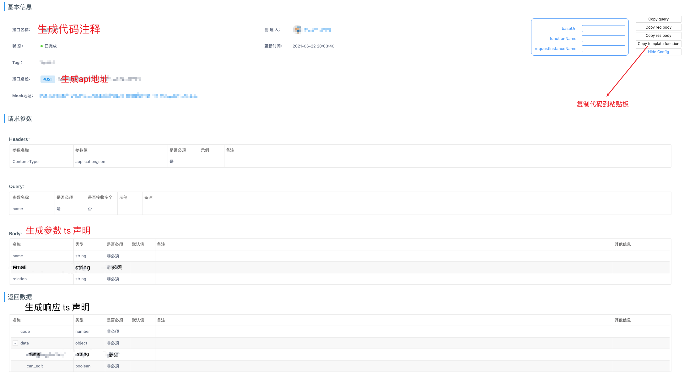

## chrome-yapiplugin 使用说明
##### 在 taoge 开发的基础上加点懒人功能

##### 该谷歌插件可以根据 yapi 接口文档自动生成 前端 api 接口代码，响应数据和参数类型的 ts 声明，一键复制到粘贴板。

1. clone 项目到本地
2. 打开 chrome菜单 -> 更多工具 -> 拓展程序
3. 右上角启用`开发者模式`
4. 点击左上角`加载已解压的拓展程序`
5. 选择 clone 的项目路径下面的 lib 文件夹
6. 打开公司 yapi 地址，查看一个 api 详情页面，右上角应该会出现 5 个按钮，点击前 4 个按钮可以直接`复制代码到粘贴板`，最后一个按钮用于`配置模板代码`，看需要可忽略

## 示例：

自动生成的代码模版：
```ts
export interface Paramsxxx {
  xxx?: string;
  xxx?: string;
  xxx?: string;
}
export interface Responsexxx {
  xx: string;
}
/**
 * desc
 */
export function @functionName(params: Paramsxxx): Promise<Responsexxx> {
  return @baseUrl.post(@baseUrl, { ...params });
}

```

post 请求的接口文档 & 自动生成的代码：



```ts
export interface ParamsGetContact {
  name?: string;
  email?: string;
  relation?: string;
}
export interface ResponseGetContact {
  name: string;
  canEdit?: boolean;
}
    
/**
 * 获取员工信息接口
 */
export function getContact(params: ParamsGetContact): Promise<ResponseGetContact> {
  return request.post('/api/web/demo/id/get-contact/', { ...params });
}
```

get 请求自动生成的代码：

```ts
  
export interface ParamsGetPermissionData {
  dataType: string;
}
export type GetPermissionData = {
  id: number;
  name: string;
  type: number;
}
export type ResponseGetPermissionData = Array<GetPermissionData>
    
/**
 * 获取权限
 */
export function getPermissionData(params: ParamsGetPermissionData): Promise<ResponseGetPermissionData> {
  return request.get('/psc/api/v1/app/service/user/getPermissionRegionData', { params });
}
```

### 配置参数

baseUrl: 基于 axios/fetch 的接口 base 地址

functionName: 函数名称 建议直接默认会根据 api 接口生成

requestInstanceName: axios 实例名次 看团队/项目需求
